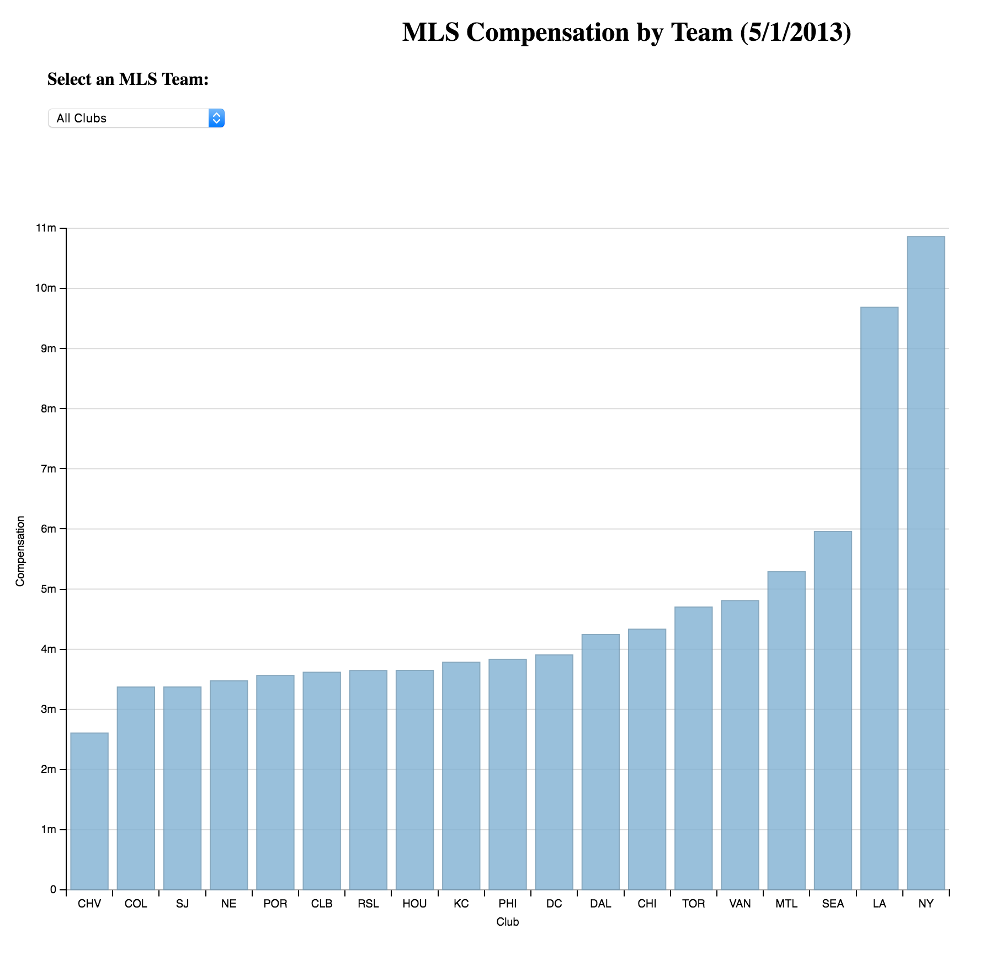
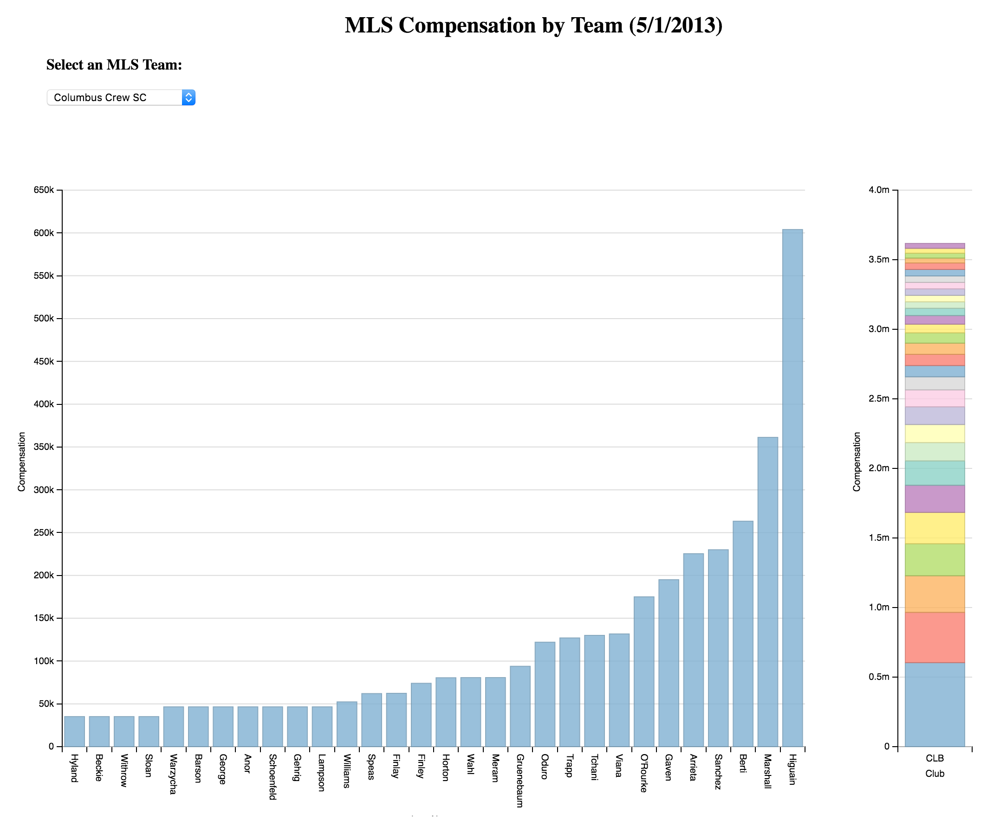

# MLS Salary Comparison
---
[Live Chart]
[Live Chart]: https://bl.ocks.org/zepdrix/raw/61dae93adbafec1d232325ab94e363b1/
This is an interactive chart that allows users to compare the Major League Soccer club player compensations. The data is from the MLS Players Union and reflects surveys through 5/1/2013. A dropdown allows the user to compare the total compensation for each club or to look at the distribution of compensation for a specific club.

The charts were created with dimple.js and d3.js.

## All Clubs
---
Selecting all clubs shows the total compensation for each club in the MLS in a bar graph.

## Individual Club
---
Selecting an individual club shows the compensation for each player in a bar graph as well as a graph of how each player's compensation compares to the club's total compensation.

